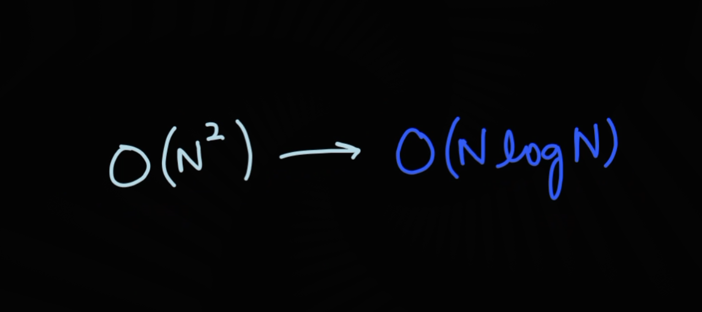
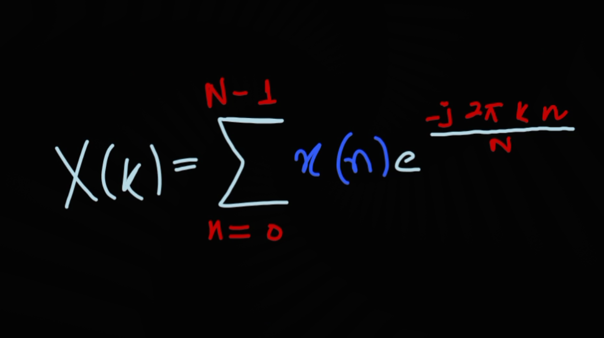
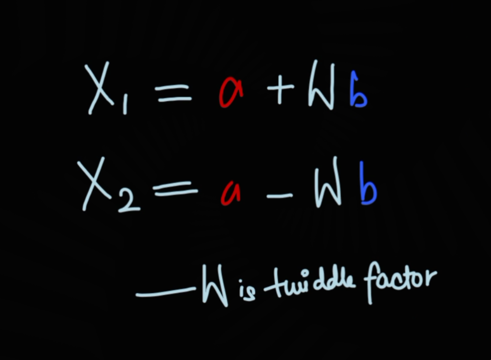

# Abstract

This project is about implementing the radix-2 Decimation-In-Time (DIT) Fast Fourier Transform (FFT) from scratch and also visualizing how it works step by step. The input signal is first zero-padded so that its length becomes a power of 2, and then it is rearranged using bit-reversal. After that, the FFT is computed using iterative butterfly operations along with twiddle factors. The output at each stage is stored and plotted so that the transformation from time domain to frequency domain can be clearly seen. The final output is also compared with the built-in FFT function, and the error is very small (almost zero), which shows that the implementation is correct.

# Index Terms

Fast Fourier Transform, DIT FFT, Bit Reversal, Butterfly Operation, Signal Processing

# I. INTRODUCTION

The Fast Fourier Transform (FFT) is a very important algorithm in digital signal processing. It is used to convert a signal from time domain into frequency domain. Normally, the Discrete Fourier Transform (DFT) takes a lot of computation (around O(N^2)), which becomes slow for large signals. FFT improves this by reducing the complexity to O(NlogN).

In this project, the radix-2 DIT FFT is implemented from scratch instead of using any built-in functions. The main goal was not just to compute FFT, but also to understand how it actually works internally. For that reason, stage-wise visualization was also done.

# II. THEORY
### A. Discrete Fourier Transform

The DFT of a signal is given by:

This equation basically tells how much of each frequency is present in the signal.

### B. Fast Fourier Transform

FFT reduces the computation by breaking the signal into smaller parts. In radix-2 FFT, the signal is divided into even and odd indexed samples and then combined using a specific pattern.

### C. Bit Reversal

Before applying FFT, the input signal needs to be rearranged. This is done using bit-reversal, where the binary representation of indices is reversed. This step helps in performing the FFT iteratively instead of recursively.

### D. Butterfly Operation

The butterfly is the main computation step in FFT. It takes two values and combines them using addition and subtraction along with a rotation factor called the twiddle factor.

This operation is repeated multiple times across stages.

# III. METHODOLOGY

The implementation was done step by step as follows:

#### Input
The user enters a discrete-time signal from the terminal.

#### Zero Padding
If the length of the signal is not a power of 2, zeros are added at the end.

#### Bit Reversal
The signal is reordered using reversed binary indices.

#### FFT Computation
The FFT is computed iteratively using loops:
- Each stage increases the group size
- Butterfly operations are applied
- Twiddle factors are used for rotation

#### Stage Storage
The output after each stage is stored so that it can be visualized later.

#### Verification
The result is compared with the built-in FFT function to check correctness.

# IV. RESULTS

The output of the implementation includes:

Bit-reversed signal plot
Stage-wise FFT plots
Final FFT output

The difference between the implemented FFT and the built-in FFT is extremely small (around 10
−15
), which is due to numerical precision and can be ignored.

FIGURES INSIDE /plots.
Fig. 1: Original vs Bit-Reversed Signal
Fig. 2: Stage-wise FFT Output

# V. DISCUSSION

From the stage-wise plots, it can be clearly seen how the FFT builds up gradually. In the beginning stages, only nearby elements are combined. As the stages increase, the interaction spreads across the entire signal.

This makes it easier to understand that FFT is not a single step process, but a series of smaller operations that finally give the frequency components.

Bit-reversal also plays an important role because without it, the butterfly operations would not work correctly in an iterative approach.

# VI. CONCLUSION

In this project, the radix-2 DIT FFT was successfully implemented and visualized. The results matched closely with the built-in FFT function, confirming correctness.

The main takeaway from this project is that FFT is not just a formula, but a structured process involving bit-reversal, butterfly operations, and stage-wise computation. Visualizing each stage helped in understanding how the algorithm works internally.

# REFERENCES
1. A. V. Oppenheim and R. W. Schafer, "Discrete-Time Signal Processing."

2. S. K. Mitra, "Digital Signal Processing."

3. MATLAB/Octave FFT Documentation.
